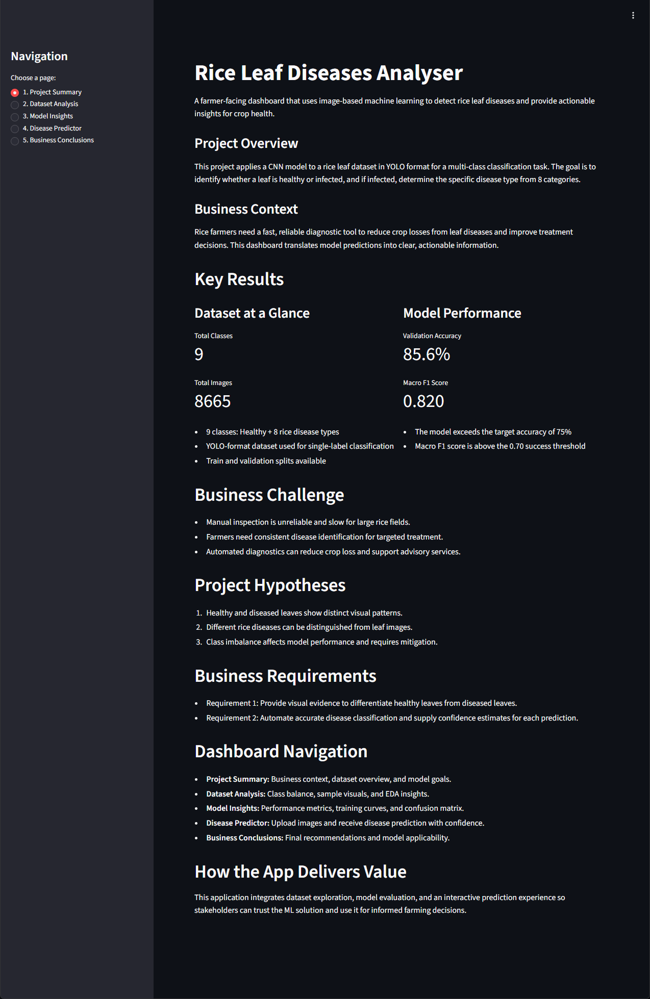
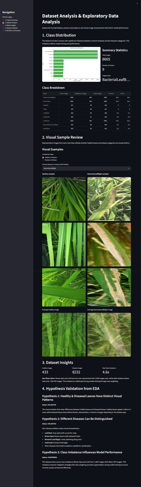
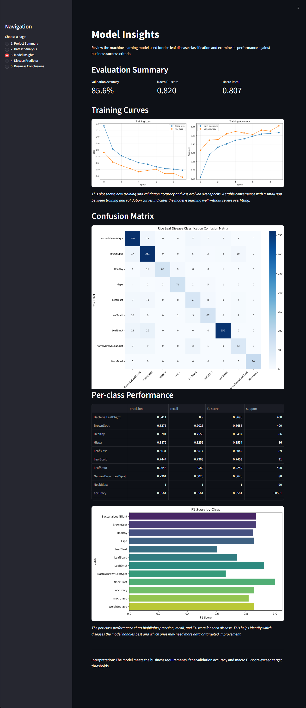
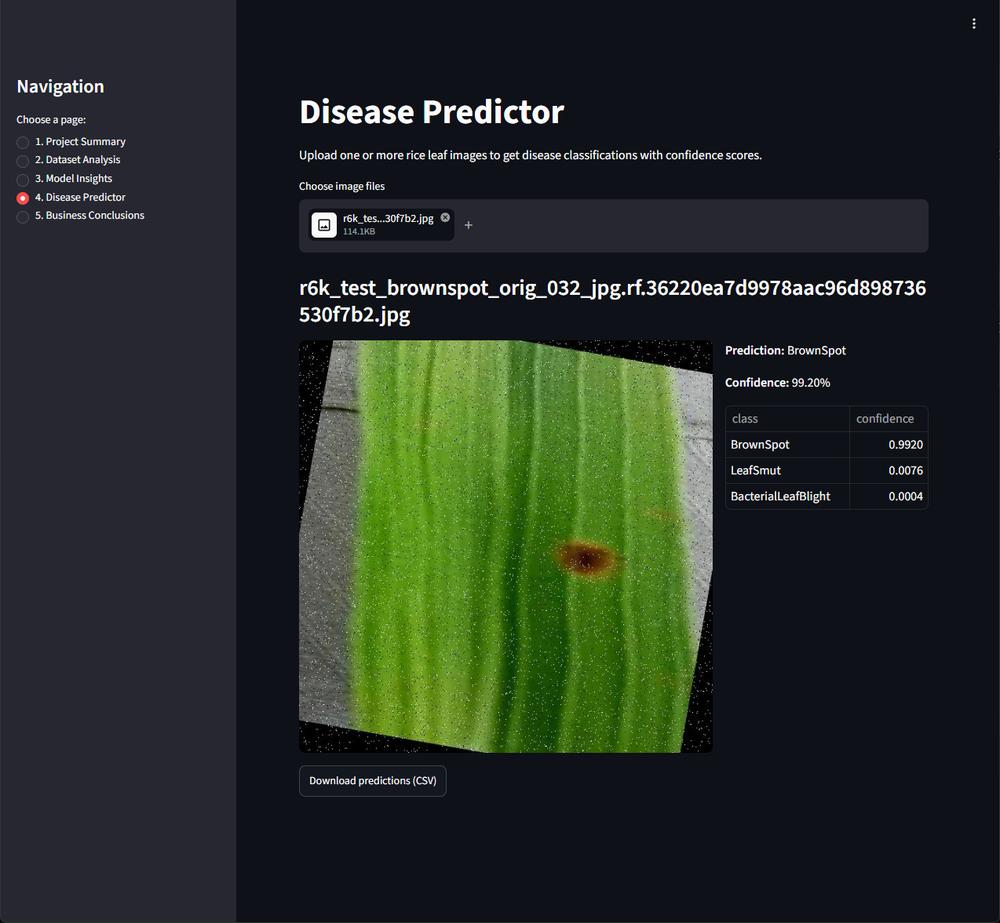
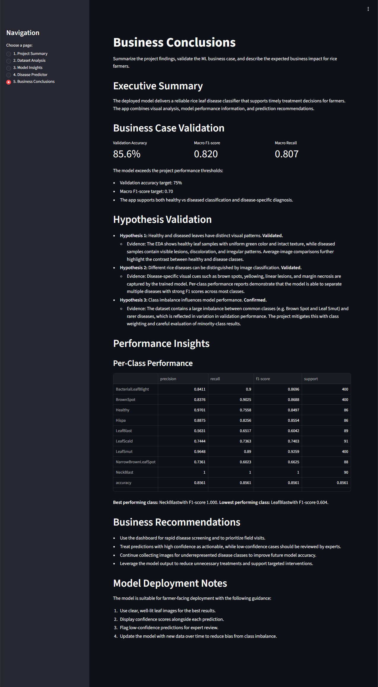

# Rice Leaf Diseases Analyser

This project explores the use of machine learning and computer vision techniques for rice leaf disease classification. Using a publicly available image dataset, the study investigates whether visual patterns in rice leaves can be used to distinguish healthy plants from those affected by disease and identify the most likely disease category.

The project combines exploratory data analysis, image preprocessing, model training, and evaluation within an interactive Streamlit dashboard designed to support the defined business requirements and validate the project hypotheses.

The application is deployed on Render and is available at: [Rice Leaf Disease Analyser](https://rice-leaf-diseases-analyser.onrender.com/).


## Dataset Content

The dataset consists of annotated images of rice leaves for disease classification in precision agriculture. It includes healthy leaves and multiple common rice diseases, enabling the development of computer vision models for automated disease identification and disease type classification.

**Dataset Format & Usage Note:** The data is stored in YOLO format (bounding boxes with class IDs), but it is used functionally in this project as a single-label image classification dataset. Each image contains a single disease category or healthy status. The bounding boxes provide spatial context in the source annotations but are not consumed by the current classification pipeline.

**Class Mapping Location:** Class-to-ID mapping is defined inside the project notebooks (preprocessing/modeling) based on `data.yaml` from dataset.

### Dataset Overview

- Total Classes: 9 (1 healthy + 8 disease types)
- Primary Task: Multi-class Disease Classification
- Storage Format: YOLO (bounding box coordinates with class IDs)
- Functional Usage: Single-label image classification
- Data Split: Training and Validation sets

### Class Labels

The dataset contains the following categories:

| ID | Class Name                     | Description                          |
|----|--------------------------------|--------------------------------------|
| 0  | Bacterial Leaf Blight          | Bacterial disease causing leaf drying |
| 1  | Brown Spot                     | Fungal disease with brown lesions     |
| 2  | Healthy                        | Normal, unaffected rice leaves        |
| 3  | Hispa                          | Pest damage caused by rice hispa      |
| 4  | Leaf Blast                     | Severe fungal infection               |
| 5  | Leaf Scald                     | Disease causing drying leaf edges     |
| 6  | Leaf Smut                      | Fungal disease affecting grains/leaves|
| 7  | Narrow Brown Leaf Spot         | Narrow brown lesions on leaves        |
| 8  | Neck Blast                     | Infection affecting the plant neck    |

### Data Structure

The dataset follows a standard YOLO directory layout:
```
rice/
│
├── images/
│ ├── train/ # Training images
│ └── val/ # Validation images
│
├── labels/
│ ├── train/ # Bounding box annotations
│ └── val/ # Bounding box annotations
│
└── data.yaml # Class mapping configuration
```


Each image is paired with a corresponding `.txt` annotation file containing class IDs and bounding box coordinates of the affected region.

### Dataset Usage Notes

- **Single Label per Image:** Each image contains exactly one disease class label, representing either a healthy leaf or a single disease type affecting the leaf.
- **Class Imbalance:** The dataset is imbalanced, with some classes (e.g., Brown Spot, Leaf Smut) having significantly more samples than others. This imbalance is reflected in model performance across classes.
- **Bounding Box Use:** Bounding box coordinates indicate the affected area on the leaf, providing spatial context for the disease manifestation.
- **Current Task:** Images are classified into one of 9 categories (healthy or one of 8 disease types), making this a multi-class image classification problem rather than an object detection problem.


## Business Context & Requirements

The client is a fictional agricultural advisory service working with rice farmers to improve crop health and reduce yield loss caused by leaf diseases. Early and accurate disease identification is critical for:
- Preventing the spread of infections through timely intervention
- Supporting treatment decisions specific to the identified disease
- Reducing crop losses from undiagnosed or misdiagnosed diseases

**Current Challenge:**
Disease detection relies mainly on manual visual inspection by farmers or extension officers, which is:
- Inconsistent across different inspectors and growing regions
- Time-consuming for large-scale farm monitoring
- Dependent on expert knowledge that may not be widely available
- Prone to human error, especially for visually similar diseases


### Business Requirements

**Requirement 1 - Visual Evidence & Analysis:**
The client is interested in a study that visually differentiates healthy rice leaves from leaves affected by different diseases. This supports farmer education and builds confidence in automated recommendations.

**Requirement 2 - Automated Disease Classification:**
The client is interested in a machine learning solution capable of accurately classifying rice leaf images to identify both:
- Whether the leaf is healthy or infected
- If infected, the specific disease type (from 8 disease categories)

This classification enables targeted, disease-specific treatment recommendations.


## Hypotheses

### Hypothesis 1 - Healthy and Diseased Leaves Have Distinct Visual Patterns

**Hypothesis:**
Healthy rice leaves and diseased rice leaves exhibit noticeable visual differences in color, texture, and lesion patterns.

**Status:** VALIDATED

**Evidence & How we validated it in this project:**
- Dataset Analysis presents sample grids showing consistent visual differences: healthy leaves are generally uniform green, while diseased leaves show lesions, spotting, or margin necrosis.
- Average-image comparisons (Dataset Analysis) highlight persistent lesion regions and color shifts for disease classes versus healthy samples.
- Color histograms and distribution plots show measurable differences in pixel value distributions between healthy and diseased images.

### Hypothesis 2 - Different Rice Diseases Can Be Distinguished from Images

**Hypothesis:**
Different rice leaf diseases contain unique visual characteristics that allow them to be differentiated from one another using image classification techniques.

**Status:** VALIDATED

**Evidence & How we validated it in this project:**
- Visual EDA and pairwise class comparisons show disease-specific cues (e.g., brown lesions for Brown Spot, concentric rings for Leaf Blast, linear yellowing for Bacterial Leaf Blight).
- The trained classifier demonstrates per-class separation in `Model Insights`: most classes achieve strong F1-scores and high true-positive rates on the confusion matrix.
- Misclassification analysis (confusion matrix, classification report) pinpoints specific confusions and supports targeted data-collection or augmentation strategies.

### Hypothesis 3 - Class Imbalance Influences Model Performance

**Hypothesis:**
The imbalance in class distribution negatively affects prediction performance for underrepresented disease categories.

**Status:** CONFIRMED

**Evidence & How we validated it in this project:**
- Class distribution plots (Dataset Analysis) reveal large skew: some classes (e.g., Brown Spot, Leaf Smut) have many more samples than others.
- Per-class metrics in `Model Insights` show lower recall/F1 for several minority classes, consistent with imbalance-driven performance drops.
- Mitigations applied: class weighting during training and data augmentation for minority classes; further data collection is recommended for persistent low-performing classes.

**Where to see these results in the dashboard:** Dataset Analysis (visual examples, averages, histograms), Model Insights (training curves, confusion matrix, per-class F1), and Business Conclusions (summaries and recommendations).


## Rationale — Mapping Requirements to Visualisations & ML Tasks

This rationale explains why each business requirement is implemented via the chosen visualizations and ML tasks, and how those artefacts support decision-making.

- **Requirement 1 — Visual Evidence & Analysis**
  - Visualisations: class distribution bar charts, sample image grids, average-image comparisons, and color histograms.
  - ML / data tasks: label verification, image cleaning, stratified sampling, and augmentation for minority classes.
  - Why: Visual evidence demonstrates separability and dataset quality (supports farmer trust and Requirement 1).

- **Requirement 2 — Automated Disease Classification**
  - Visualisations: training curves, confusion matrix, per-class precision/recall/F1 charts, and classification report tables.
  - ML / model tasks: transfer-learning model training, class-weighting, hyperparameter tuning, per-class error analysis, and model calibration.
  - Why: These artifacts quantify model reliability and expose class-level weaknesses so the classifier can be made actionable (supports Requirement 2).

- **Success Metrics & Monitoring**
  - Visualisations: metric cards (validation accuracy, macro F1), epoch curves for stability, and class-level performance charts.
  - Tasks: track evaluation metrics during training, record model artifacts, and include per-class thresholds to trigger further data collection.
  - Why: Mapping metrics to visuals ensures stakeholders can quickly verify if success criteria (e.g., 75% accuracy, 0.70 macro F1) are met.

Use the `Dataset Analysis` and `Model Insights` pages together to connect the visual evidence (what the data looks like) with the ML outcomes (how the model performs), and consult `Business Conclusions` for recommended actions tied to those results.


## Machine Learning Business Case

### Problem Statement
Rice farmers need a fast, accurate, and accessible method to identify and classify rice leaf diseases from leaf images, enabling timely and disease-specific treatment decisions.

### Learning Approach
**Multi-class Image Classification using Convolutional Neural Networks (CNN)**

- **Why Classification:** Each leaf image shows a single dominant disease state (healthy or one disease type). The goal is to assign it to the most likely category.
- **Why CNN:** Convolutional neural networks are well-suited for learning spatial patterns in images (colors, textures, lesion shapes) that distinguish disease types.
- **Model Architecture:** Transfer learning approach using pre-trained MobileNetV2 backbone, fine-tuned on rice leaf disease data. This approach balances model complexity with training efficiency.

### Ideal Outcome
A model that can:
1. **Correctly identify healthy leaves** - Minimize false positives (healthy leaves misclassified as diseased) to avoid unnecessary treatment costs.
2. **Accurately classify disease type** - For infected leaves, predict the correct disease with high confidence to enable targeted treatment.
3. **Handle visual ambiguity** - When diseases are visually similar, make confident predictions based on learned patterns.
4. **Perform consistently** - Maintain accuracy across all disease classes despite class imbalance in training data.

### Success Metrics (Model Performance Requirements)

**Overall Model Performance:**
- **Validation Accuracy ≥ 75%:** Model correctly classifies at least 75% of validation images across all 9 classes.
- **Macro-averaged F1-score ≥ 0.70:** Average precision and recall across all disease classes is satisfactory, indicating balanced performance even for minority classes.

**Per-Class Performance:**
- **Healthy Class Precision ≥ 80%:** When the model predicts "Healthy," it should be correct at least 80% of the time (minimize false positives).
- **Disease Classes Recall ≥ 65%:** For each disease class, the model should identify at least 65% of actual disease cases (minimize missed infections).
- **No Class Below 50% Accuracy:** Even minority disease classes should achieve >50% accuracy to be actionable.

**Business Applicability:**
- **Dashboard Usability:** Model predictions are presented with confidence scores and reasoning on an interactive dashboard.
- **Farmer Trust:** The dashboard presents sample images and prediction explanations.
- **Actionable Recommendations:** Each prediction includes suggested treatment and next steps.

### Model Output & User Relevance

**What the Model Provides:**
- **Disease Classification:** Prediction of one class from 9 categories (Healthy or 8 disease types).
- **Confidence Score:** Probability distribution across all classes, showing model certainty.
- **Visual Evidence (current status):** The source dataset includes bounding boxes that mark affected regions, but the existing ML pipeline does not produce bounding-box overlays or region highlights. The notebooks and dashboard present model predictions, confidence scores, and example images instead.

**Planned Enhancement:** Add localized visual explanations (e.g., bounding-box overlays, Grad-CAM, or attention maps) in future work to show where the model focuses when making predictions.

**How Farmers Use It:**
- Farmers photograph or upload a rice leaf image to the dashboard.
- Model returns disease classification with confidence.
- Farmer receives disease-specific treatment recommendations and timing guidance.
- Enables faster decision-making compared to manual inspection or waiting for expert consultation.

### Heuristics & Training Data Used

**Data Preprocessing:**
- Images resized to 256×256 pixels for model input.
- Data augmentation applied during training: rotations, flips, brightness/contrast adjustments to improve generalization.
- Class labels extracted from YOLO annotation files; single disease label per image used for classification.

**Training Configuration:**
- **Base Model:** MobileNetV2 pre-trained on ImageNet, transfer learning approach.
- **Loss Function:** Categorical cross-entropy (appropriate for multi-class classification).
- **Optimizer:** Adam optimizer with default learning rates.
- **Early Stopping:** Training stops if validation loss does not improve for a patience period, preventing overfitting.
- **Class Weighting:** Applied to handle dataset imbalance—minority disease classes receive higher loss weights during training.

### Known Limitations & Considerations

1. **Dataset Imbalance:** Some diseases (e.g., Leaf Smut, Brown Spot) have many more training examples than others (e.g., Neck Blast). This may result in lower accuracy for minority classes.
2. **Single-Image Classification:** Each prediction is based on a single leaf image. Farmer expertise and field context should also inform final treatment decisions.
3. **Environmental & Cultivar Variations:** The dataset may not cover all rice cultivars, growing regions, or environmental conditions. Model performance may vary in new contexts.
4. **Bounding Box Information:** While bounding boxes indicate affected regions, the current model uses the full image for classification, not spatial attention to the affected area.

### Next Steps for Improvement

- Collect more data for minority disease classes to improve balance.
- Explore class-balanced sampling or advanced imbalance handling techniques.
- Investigate misclassified examples to understand visual confusion between disease types.
- Consider ensemble methods combining multiple models for improved robustness.
- Integrate farmer feedback to refine recommendations and model retraining strategy.


## Project Epics & User Stories
This section describes the key work streams and product-oriented user stories that align the analytics, model development, dashboard design, and deployment goals with the business requirements.

### Epic 1: Data Collection and Information Gathering
As a data analyst, gather and document the dataset characteristics needed for reliable disease modeling.
- User Story 1.1: As a data analyst, I want to inspect the rice leaf dataset and verify class labels so that the disease categories are correctly defined for modeling.
- User Story 1.2: As a data analyst, I want to document dataset quality and class imbalance so that the project can address biases before training.
- User Story 1.3: As a data analyst, I want to confirm the dataset format and annotation structure so that the ML pipeline can use the data consistently.
- User Story 1.4: As a data analyst, I want to map the dataset back to business requirements so that the model supports healthy-versus-diseased classification and disease-specific diagnosis.

### Epic 2: Data Visualization, Cleaning and Preparation
As a data analyst and data scientist, prepare the dataset and produce visual evidence that supports model-ready input.
- User Story 2.1: As a data analyst, I want to generate class distribution and imbalance plots so that I can validate Requirement 1 and quantify dataset skew.
- User Story 2.2: As a data scientist, I want to create sample image visualizations for healthy and diseased leaves so that decision-makers can see the visual differences.
- User Story 2.3: As a data scientist, I want to preprocess and augment images for model training so that the classifier generalizes across field conditions.
- User Story 2.4: As a data scientist, I want to produce dataset summaries and EDA findings so that the dashboard transparently reflects the training data.

### Epic 3: Model Training
As a data scientist, train and evaluate a disease classification model that satisfies the defined success metrics.
- User Story 3.1: As a data scientist, I want to train a CNN model on rice leaf images so that it can distinguish healthy leaves from 8 disease categories.
- User Story 3.2: As a data scientist, I want to evaluate the model using validation accuracy and macro F1-score so that it meets the business performance thresholds.
- User Story 3.3: As a data scientist, I want to analyze per-class metrics and confusion matrix results so that I can identify which disease classes require more data or tuning.
- User Story 3.4: As a data scientist, I want to document model limitations and treatment of class imbalance so that stakeholders understand performance tradeoffs.

### Epic 4: Dashboard Planning, Design and Development
From a non-technical user perspective, design a dashboard that makes model insights and predictions accessible.
- User Story 4.1: As a product stakeholder, I want a Project Summary page so that I can understand the business problem and project objectives quickly.
- User Story 4.2: As a non-technical user, I want a Dataset Analysis page so that I can see visual evidence of healthy vs diseased leaves and class imbalance.
- User Story 4.3: As a non-technical user, I want a Model Insights page so that I can review training performance and model reliability before using predictions.
- User Story 4.4: As a farmer or extension officer, I want a Disease Predictor page so that I can upload a leaf image and get a disease classification with confidence.
- User Story 4.5: As a business sponsor, I want a Business Conclusions page so that I can see whether the project met the defined requirements.

### Epic 5: Dashboard Deployment / Project Release
Just about exploring as a user and reproducing the work as a technical user.
- User Story 5.1: As a user, I want to launch the dashboard locally so that I can explore the model and results without needing a separate deployment environment.
- User Story 5.2: As a technical user, I want clear run instructions and project structure so that I can reproduce the solution from source.
- User Story 5.3: As a user, I want the dashboard to present actionable recommendations so that I can make decisions based on the predictions.
- User Story 5.4: As a technical user, I want the model artifacts and evaluation outputs included in the repository so that I can validate the results and extend the project.


## Dashboard Design

The Streamlit dashboard is organized to meet the business requirements and guide both technical and non-technical users through the analysis, model evaluation, and operational use of the classifier.

- **Project Summary**
  - Purpose: Give an accessible executive overview of the problem, dataset, objectives, and key takeaways.
  - Key visuals: short project description, top-level evaluation metric cards, links to notebooks and artifacts.
  - Intended users: product sponsors, project managers, and new team members who need a high-level summary.

    <details>
      <summary><b>Click To Expand Full Page Preview</b></summary>

      

    </details>

- **Dataset Analysis**
  - Purpose: Provide visual evidence that healthy and diseased leaves are separable and document dataset quality.
  - Key visuals: class distribution bar chart, sample image grids, average-image comparisons, color histograms.
  - Interactions: select classes to compare, view averaged images and per-class samples, inspect class counts.
  - Intended users: data analysts, data scientists, and stakeholders verifying Requirement 1.

    <details>
      <summary><b>Click To Expand Full Page Preview</b></summary>

      

    </details>

- **Model Insights**
  - Purpose: Examine training behavior and per-class performance to validate the ML business case.
  - Key visuals: training curves (accuracy/loss), confusion matrix, per-class precision/recall/F1 charts, classification report table.
  - Interactions: review epoch curves, inspect confusion matrix cells, export per-class metrics for analysis.
  - Intended users: data scientists and technical reviewers assessing Requirement 2 and success metrics.

    <details>
      <summary><b>Click To Expand Full Page Preview</b></summary>

      

    </details>

- **Disease Predictor**
  - Purpose: Provide an operational interface for users to obtain disease classifications from leaf images.
  - Key visuals: uploaded image preview (with optional YOLO bbox overlay), top-3 predictions with confidence, downloadable CSV for batch runs.
  - Interactions: upload single or multiple images, view top predictions, download results, inspect predicted probabilities.
  - Intended users: farmers, extension officers, and field technicians using the tool for screening and triage.

    <details>
      <summary><b>Click To Expand Full Page Preview</b></summary>

      

    </details>

- **Business Conclusions**
  - Purpose: Summarize validated hypotheses, surface business recommendations, and provide deployment guidance.
  - Key visuals: executive metrics, best/worst class summaries, recommended next steps and data collection priorities.
  - Intended users: decision-makers and deployment engineers who will act on the model outputs.

    <details>
      <summary><b>Click To Expand Full Page Preview</b></summary>

      

    </details>


### Project Structure for the Dashboard

- `app.py`: main Streamlit app entry point
- `app_pages/`: page modules for each dashboard section
- `src/`: helper modules for data loading, model prediction, and visualization
- `inputs/`: dataset and annotation files
- `outputs/`: saved evaluation results, model artifacts, and visualizations


## Testing

### Manual Testing

This subsection lists the core dashboard pages and key features to verify manually in the live Streamlit app.

| Page and Feature | Action | Expected Result | Pass / Fail |
|---|---|---|---|
| Dashboard | Open the deployed live link | Deployed app opens and loads successfully | Pass |
| Dashboard | Click each sidebar navigation item | Each sidebar selection opens its corresponding page | Pass |
| Project Summary page | Open the page in Streamlit | Page loads and shows project goals, scope and success criteria | Pass |
| Dataset Analysis page | Open the page in Streamlit | Dataset visuals and distribution insights display correctly | Pass |
| Dataset Analysis page | Use visual example comparison tools | Comparison widgets respond and show selected images or averages | Pass |
| Model Insights page | Open the page in Streamlit | Evaluation metrics and confusion matrix appear correctly | Pass |
| Disease Predictor page | Upload a sample leaf image | Prediction results and confidence scores display | Pass |
| Disease Predictor page | Upload multiple leaf images | Multiple uploads are accepted, and batch prediction results appear | Pass |
| Disease Predictor page | Download predictions as CSV | Predictions are exported and downloaded correctly | Pass |
| Business Conclusions page | Open the page in Streamlit | Recommendations and validated hypotheses are shown | Pass |

### User Story Testing

This subsection lists each user story by epic, how it was tested, and the current pass/fail status. Keep the result column simple and update it to `Pass` or `Fail` after executing the test.

**[Epic 1](#epic-1-data-collection-and-information-gathering): Data Collection and Information Gathering**

| User Story | How it was tested | Pass / Fail |
|---|---|---|
| User Story 1.1 | Check that `src.data_utils` imports without error and class mapping files exist. | Pass |
| User Story 1.2 | Confirm `outputs/datasets/eda/class_distribution.csv` exists. | Pass |
| User Story 1.3 | Confirm `inputs/datasets/raw/rice/data.yaml` and label `.txt` files exist. | Pass |
| User Story 1.4 | Verify the README and epic documentation reference business requirements. | Pass |

**[Epic 2](#epic-2-data-visualization-cleaning-and-preparation): Data Visualization, Cleaning and Preparation**

| User Story | How it was tested | Pass / Fail |
|---|---|---|
| User Story 2.1 | Verify class distribution plotting code is present and imports cleanly. | Pass |
| User Story 2.2 | Verify Dataset Analysis page includes sample image comparisons and average-image features. | Pass |
| User Story 2.3 | Check that preprocessing and augmentation are documented in notebooks or code. | Pass |
| User Story 2.4 | Confirm EDA output files exist under `outputs/datasets/eda/`. | Pass |

**[Epic 3](#epic-3-model-training): Model Training**

| User Story | How it was tested | Pass / Fail |
|---|---|---|
| User Story 3.1 | Confirm model artifacts exist under `outputs/models/`. | Pass |
| User Story 3.2 | Confirm `outputs/evaluation/evaluation_summary.csv` exists and is readable. | Pass |
| User Story 3.3 | Confirm `classification_report.csv` and `confusion_matrix.png` exist in `outputs/evaluation/`. | Pass |
| User Story 3.4 | Verify documentation describes class imbalance and model limitations. | Pass |

**[Epic 4](#epic-4-dashboard-planning-design-and-development): Dashboard Planning, Design and Development**

| User Story | How it was tested | Pass / Fail |
|---|---|---|
| User Story 4.1 | Confirm `Project Summary` page file exists and loads without import errors. | Pass |
| User Story 4.2 | Confirm `Dataset Analysis` page file exists and loads without import errors. | Pass |
| User Story 4.3 | Confirm `Model Insights` page file exists and loads without import errors. | Pass |
| User Story 4.4 | Confirm `Disease Predictor` page file exists and loads without import errors. | Pass |
| User Story 4.5 | Confirm `Business Conclusions` page file exists and loads without import errors. | Pass |

**[Epic 5](#epic-5-dashboard-deployment--project-release): Dashboard Deployment / Project Release**

| User Story | How it was tested | Pass / Fail |
|---|---|---|
| User Story 5.1 | Confirm local run instructions exist in README and `requirements.txt`. | Pass |
| User Story 5.2 | Confirm project structure is documented. | Pass |
| User Story 5.3 | Confirm business recommendations are included in `Business Conclusions`. | Pass |
| User Story 5.4 | Confirm model artifacts and evaluation outputs are included in the repository. | Pass |

### Validation

The project code was validated throughout development using the Flake8 extension for Visual Studio Code to help maintain compliance with PEP 8 coding standards and promote code consistency.

No significant Flake8 issues remain in the project. The only reported warnings are instances of `E402 module level import not at top of file`

These warnings occur within Jupyter notebooks where certain setup operations (such as configuring the project root directory or setting environment variables) must be executed before importing some modules. This is a common pattern in notebook-based workflows and does not affect the functionality, readability, or maintainability of the code.

All imports are grouped at the beginning of their respective notebook sections, and the `E402` warnings were therefore considered acceptable and left unresolved.


## Deployment on Render

This project can be deployed on a free Render instance using Streamlit and a simple blueprint setup. A free Render service is suitable for demonstration and light usage.

1. Create a Render account and start a new project.
   - See Render’s onboarding guide for your first deployment: https://render.com/docs/your-first-deploy
2. Use the public repository or your own fork:
   - Repository: https://github.com/sasha-fedorov/rice_leaf_diseases_analyser
3. Set up a Render service using a free instance:
   - Add a new service to your Render project.
   - Choose a name for the service.
   - Select the `Free` instance plan.
   - Use this build command:
     - `pip install --upgrade pip && pip install -r requirements-render.txt`
   - Use this start command:
     - `streamlit run app.py --server.port $PORT --server.address 0.0.0.0`
   - Set the environment variable:
     - `PYTHON_VERSION` = `3.12.13`
4. Alternatively, add a Render blueprint:
   - In the Render dashboard, select `Blueprints`.
   - Click `New Blueprint Instance`.
   - Connect the repository.
   - Specify a name for the blueprint instance.
   - Deploy the blueprint.


## Forking and Cloning

This section explains how to fork or clone this repository.

### Forking

To fork the project repository to your own GitHub account:

1. Log in (or sign up) to GitHub.
2. Go to the repository: **[sasha-fedorov/rice_leaf_diseases_analyser](https://github.com/sasha-fedorov/rice_leaf_diseases_analyser)**.
3. Click the **Fork** button in the top right corner to create a copy under your own account.

### Cloning

1. Open the repository page on GitHub.
2. Click the **<> Code** button above the file list.
3. Copy the HTTPS URL shown in the dialog.
4. Open a terminal or command prompt on your computer.
5. Change to the folder where you want to store the project.
6. Run:
   - `git clone https://github.com/sasha-fedorov/rice_leaf_diseases_analyser`
7. Press **Enter** to create the local copy.

### Installing Requirements

- `requirements.txt` includes all development and notebook dependencies.
- `requirements-render.txt` contains the packages needed for the deployed dashboard.

To install everything needed for full local development and notebook execution, run:

```bash
pip install -r requirements.txt
```

## How to Run the Dashboard

1. Install dependencies:
```bash
pip install -r requirements.txt
```
2. Start the Streamlit app from the project root:
```bash
streamlit run app.py
```
3. Open the local URL provided by Streamlit in a browser.

